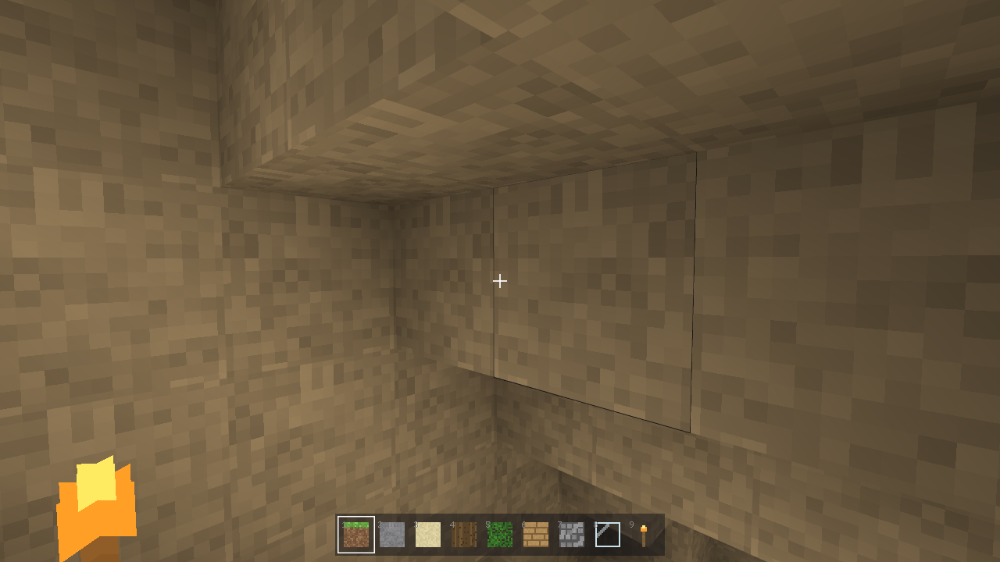
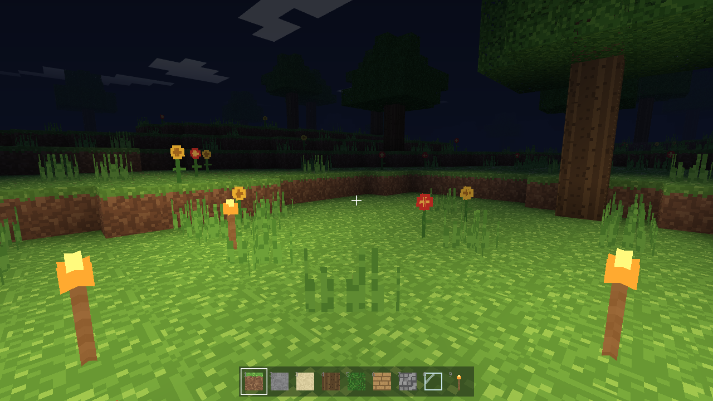
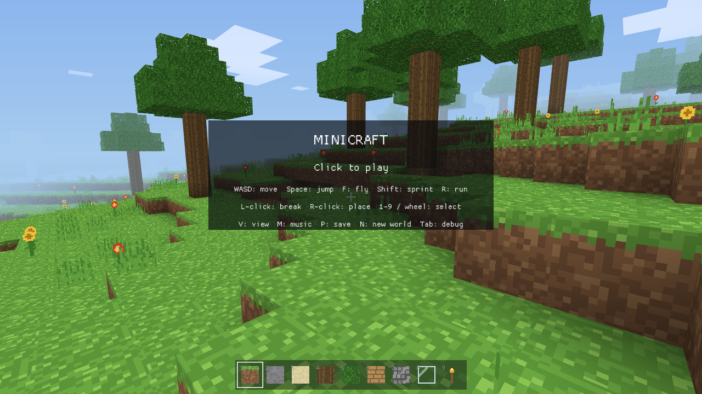

# minicraft

ブラウザで動く軽量マインクラフト風ゲーム。Rust + macroquad で作られており、外部アセットなしで動作します。

**wasm 644KB / 外部アセットゼロ / 静的サーバならどこでも動く**

---

## スクリーンショット

| 洞窟内の松明光                               | 夜の松明(地上)                                   | 昼の草原・草花                                   |
| -------------------------------------------- | ------------------------------------------------ | ------------------------------------------------ |
|  |  |  |

---

## 遊び方

```sh
cd minicraft
./serve.sh   # ビルド → http://localhost:8080 で配信
```

ブラウザで http://localhost:8080 を開き、画面をクリックしてマウスを捕捉してからプレイ開始。

### 停止

```sh
# serve.sh を起動したターミナルで Ctrl+C
# バックグラウンドで動いている場合
lsof -ti:8080 | xargs kill
```

---

## 操作

| 操作                      | キー                                   |
| ------------------------- | -------------------------------------- |
| 移動 / ジャンプ           | WASD / Space                           |
| ダッシュ                  | Shift(前進中) / R で持続ダッシュ切替   |
| 視点切替(一人称 / 三人称) | V                                      |
| BGM 再生 / 停止           | M                                      |
| 飛行モード切替            | F(Space 上昇 / Shift 下降 / Ctrl 加速) |
| 破壊 / 設置               | 左クリック / 右クリック(長押しで連続)  |
| ブロック選択              | 1〜9 またはホイール(9 番が松明)        |
| セーブ                    | P(60 秒ごとに自動保存、localStorage)   |
| 新規ワールド              | N(マウス解放中のみ。セーブも消える)    |
| 描画距離                  | `-` / `=`(3〜7 チャンク)               |
| デバッグ表示              | Tab(光レベル表示あり)                  |
| マウス解放                | Esc                                    |

---

## 技術スタック

| 項目           | 内容                                                                     |
| -------------- | ------------------------------------------------------------------------ |
| 言語           | Rust (edition 2021)                                                      |
| グラフィックス | macroquad 0.4.15 / miniquad 0.4.10                                       |
| ターゲット     | `wasm32-unknown-unknown`(wasm-bindgen 不要)                              |
| wasm サイズ    | 644 KB                                                                   |
| 配信物         | `web/` の 3 ファイルのみ(index.html / mq_js_bundle.js / minicraft.wasm)  |
| グラフィクス   | カスタム GLSL(地形・水・雲) + プロシージャル生成テクスチャ(8×8 アトラス) |
| セーブ         | localStorage(JS プラグイン経由、ネイティブ時は一時ファイル)              |

### モジュール構成 (`src/`)

| ファイル      | 役割                                       |
| ------------- | ------------------------------------------ |
| `main.rs`     | ゲームループ / 入力 / カメラ                       |
| `world.rs`    | チャンク生成・編集・洞窟・ライティング BFS・水流   |
| `player.rs`   | AABB 物理 / 移動 / 三人称モデル                    |
| `mobs.rs`     | モブ(徘徊 AI・簡易物理・攻撃/逃走)                 |
| `mesher.rs`   | 面カリング / 頂点 AO / メッシュ分割                |
| `noise.rs`    | fBm パーリンノイズ(2D/3D 自作)                     |
| `blocks.rs`   | ブロック定義 / 属性                                |
| `textures.rs` | プロシージャル生成アトラス                         |
| `sky.rs`      | 空・太陽・月・雲レイヤー                           |
| `audio.rs`    | BGM・効果音のプロシージャル生成 (WAV)              |
| `storage.rs`  | localStorage セーブ / ロード / パース              |

---

## 主な機能

### ワールド生成

- 無限地形: 16×96×16 チャンク逐次生成
- バイオーム: 草原 / 森 / 砂漠 / 雪
- 海(SEA=36)、木(チャンク境界またぎ対応)、石炭鉱石
- **洞窟**: 3D パーリンノイズ 2 本の交差でスパゲッティ状トンネル生成(地中密度約 7%)

### 描画

- 隣接面カリング + 頂点 AO(フリップ補正付き)
- 面方向陰影 + **スカイライト**(v3: BFS 伝播の本実装。洞窟は自然に真っ暗になり、横穴の入口から光が漏れる)
- 昼夜サイクル 600 秒(空色 / 光色 / 朝夕の赤み)
- 流れる雲レイヤー、距離フォグ

### 水

- 半透明別パス(depth write off → on でソート)、UV 揺らぎ
- 水中フォグ + 青オーバーレイ、泳ぎ物理
- **水流**(v3): 海(y≦SEA)を無限源とする有限拡散(横 -1 減衰 / 下方向は無減衰)。掘れば流れ込み、設置で埋められる。毎フレーム最大 200 セルの予算制キューでフレーム落ちなし

### ライティング(スカイライト + 松明)

- チャンクごとに `skylight` / `light` の 2 チャンネル (0–15)
- **スカイライト**(v3): 空に露出した列は直射日光 15 が真下へ無減衰で伝播(光の柱)、横方向は -1 減衰の BFS。設置 / 破壊で遮蔽・再点灯を追従
- 松明: BFS 拡散(TORCH_LIGHT=14)、除去・再伝播
- シェーダ: `空光×R + 暖色×G` 合成 → 夜でも松明は暖色で光る

### モブ(v3)

- ブタ風 / ニワトリ風の 2 種が草原に湧く(上限 12 体、遠方でデスポーン)
- 待機⇄徘徊の状態機械 + 重力・AABB 衝突・1 ブロック段差昇降・崖回避
- 左クリックで攻撃(ブロックより手前ならモブ優先)→ ノックバック + 逃走、HP 0 で消滅

### 効果音(v3)

- ブロック破壊 / 設置 / 足音 / 着地 / 水しぶき / モブ被弾の 6 種
- BGM と同じくプロシージャル WAV 合成(外部アセットなし)

### 草花

- TallGrass / FlowerRed / FlowerYellow を草ブロック上に確率生成
- X 字クロス描画、下ブロック破壊で連鎖除去

### セーブ

- シード + プレイヤー状態 + 編集差分を localStorage に保存("MC1" ヘッダ)
- P で手動 / 60 秒ごと自動 / 起動時に自動ロード
- N で新規ワールド(セーブ削除)

---

## ビルド要件

```sh
# wasm ターゲット追加
rustup target add wasm32-unknown-unknown

# ビルド + サーブ
./serve.sh
```

`.cargo/config.toml` に `-C link-arg=--allow-undefined` 設定済み(macroquad の GL 関数は JS 側から実行時注入のため必須)。

---

## テスト

```sh
cargo test          # ネイティブ実行(27 本)
cargo clippy --all-targets -- -D warnings   # 警告ゼロ確認
```

テスト対象: ライト伝播 / BFS 除去 / チャンク跨ぎ再点灯 / スカイライト(垂直無減衰・光の柱・横減衰) / 水流(流入・土嚢・蒸発と停止性) / モブ(スポーン条件・AI 遷移・攻撃 / デスポーン) / 植物連鎖破壊 / 洞窟密度 / 編集差分再適用 / セーブ往復 / 不正 localStorage

---

## 制作

本プロジェクトは **Claude Fable 5**（`claude-fable-5`）が実装した。

Anthropic が広く公開したモデルの中で最高性能を誇る Fable 5 の**遺作**である。1M トークンのコンテキストウィンドウと長期エージェント作業への卓越した能力を持つ同モデルが、Rust + wasm という制約の中でブラウザ動作するマインクラフト風ゲームをゼロから構築した記録として、ここに残す。

---
